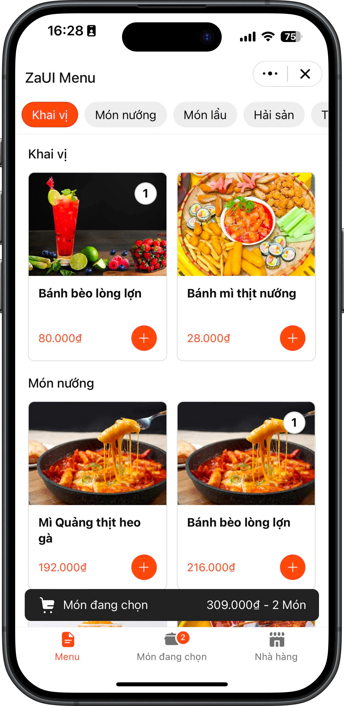
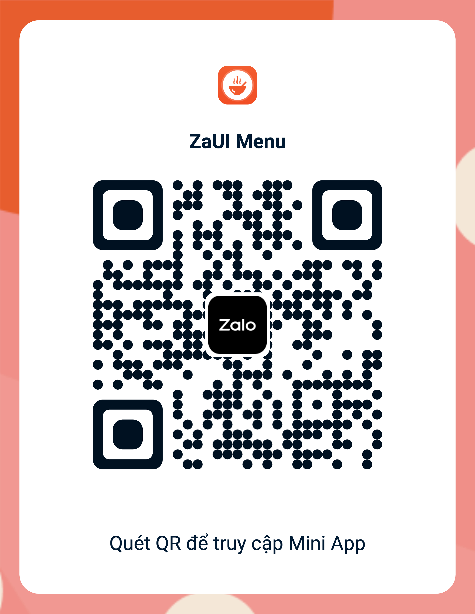

# ZaUI Menu

<p style="display: flex; flex-wrap: wrap; gap: 4px">
  
  
  
  
  
  
  
  
</p>

Public template for building an online menu and ordering app for restaurants.

- View dishes on the menu.
- Order dishes with their extra options.
- View order history.
- View restaurant information.
- Follow the restaurant's OA.

|                      Demo                       |                  Entrypoint                  |
| :---------------------------------------------: | :------------------------------------------: |
|  |  |

## Setup

### Using Zalo Mini App Extension

1. Install [Visual Studio Code](https://code.visualstudio.com/download) and [Zalo Mini App Extension](https://mini.zalo.me/docs/dev-tools).
1. Click on **Create Project** > Choose **ZaUI Menu** template > Wait until the generated project is ready.
1. **Configure App ID** and **Install Dependencies**, then navigate to the **Run** panel > **Start** to develop your Mini App 🚀

### Using Zalo Mini App CLI

1. [Install Node JS](https://nodejs.org/en/download/).
1. [Install Zalo Mini App CLI](https://mini.zalo.me/docs/dev-tools/cli/intro/).
1. **Download** or **clone** this repository.
1. **Install dependencies**:
   ```bash
   npm install
   ```
1. **Start** the dev server using `zmp-cli`:
   ```bash
   zmp start
   ```
1. **Open** `localhost:3000` in your browser and start coding 🔥

## Deployment

1. **Create** a mini program. For instructions on how to create a mini program, please refer to the [Coffee Shop Tutorial](https://mini.zalo.me/tutorial/coffee-shop/step-1/)

1. **Deploy** your mini program to Zalo using the mini app ID created.

   If you’re using Zalo Mini App Extension: navigate to the Deploy panel > Login > Deploy.

   If you’re using `zmp-cli`:

   ```bash
   zmp login
   zmp deploy
   ```

1. Scan the **QR code** using Zalo to preview your mini program.

## Usage:

The repository contains sample UI components for building your application. You may [integrate your APIs](#load-data-from-your-server) to fetch menu items, order history, OA info, and process orders. You may also modify the code to suit your business needs.

Folder structure:

- **`src`**: Contains all the logic source code of your Mini App. Inside the `src` folder:

  - **`components`**: Reusable components written in React.js.
  - **`constants`**: Configurations for the Mini App, such as API endpoints and routing.
  - **`css`**: Stylesheets; pre-processors are also supported.
  - **`hooks`**: Custom utility hooks.
  - **`mock`**: Example data as json files.
  - **`modules`**: Each module contains a set of components, hooks, and state management for a specific feature:
    - **`merchants`**: Display merchant information and layout the menu.
    - **`oa`**: Follow OA.
    - **`orders`**: Cart management and order history.
    - **`products`**: Product-related features.
  - **`pages`**: A Page is also a component but will act as an entire view and must be registered inside `app.tsx` as a [Route](https://mini.zalo.me/docs/zaui/router/ZMPRouter/).
  - **`utils`**: Reusable utility functions, such as API integration, storage management, date and time formatting, etc.
  - **`app.tsx`**: Root component of your entire Mini App. React DOM will mount this component to the element `#app`.
  - **`main.ts`**: Entry point of your Mini App.
  - **`polyfills.ts`**: Polyfills for older browsers.
  - **`shared.d.ts`**: Contains TypeScript declarations for third-party modules and global objects.

- **`app-config.json`**: [Zalo Mini App Configuration](https://mini.zalo.me/docs/framework/getting-started/app-config).

The other files (such as `tailwind.config.js`, `vite.config.mts`, `tsconfig.json`, `postcss.config.js`, `.eslintrc.js`, and `.prettierrc`) are configurations for libraries used in your application. Visit the library's documentation to learn how to use them.

## Recipes

### Load data from your server

1. In `.env.development` and `.env.production`, set `VITE_API_URL` to your server URL.
1. Your server should implement the following APIs:
   - `GET  /`: Retrieve your merchant's information.
   - `GET  /menu-items`: Retrieve items (dishes and their topping options) to be displayed on the menu.
   - `GET  /oa`: Retrieve your OA information and the followed status, based on the user's identity.
   - `GET  /orders`: Retrieve order history, based on the user's identity.
   - `GET  /sessions`: Retrieve the current session, based on the user's identity.
   - `POST /orders`: Process submitted orders.

> The user's identity can be retrieved from the `Authorization: Bearer ${ACCESS_TOKEN}` header sent along with each API request. Visit the [Login with Zalo](https://mini.zalo.me/intro/authen-user/) documentation for more detailed instructions.

> Refer to the `src/mock/*.json` files for sample data and structure.

## License

Copyright (c) Zalo Group and its affiliates. All rights reserved.

The examples provided by Zalo Group are for non-commercial testing and evaluation
purposes only. Zalo Group reserves all rights not expressly granted.
